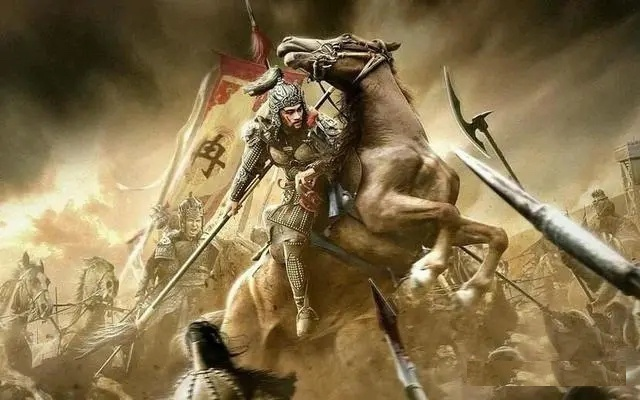

# The first appearance of Shu-Mount

As the night grew chilly, a loud shout came from General Ran Min's tent in the main camp: "The barbarians fear power but have no gratitude. My mind is made up. Let the 'Kill the Barbarians' edict be spread throughout the land. All heroes of the world shall join forces to exterminate these savage beasts!"

The other generals responded with a resounding cheer. White Eyebrows, a warrior with a face like jade and a tall, slender figure, remained silent. After a moment, he bowed and slowly backed out of the commander's tent.

White Eyebrows walked to the stable and led out a black, swift horse. He then said farewell to the guards and spurred the horse towards the foot of Mount Wawu. His eyes glinted in the moonlight as he rode off on his mission, looking every bit like a gallant scholar in white robes.

He looked up at the moon and his eyes shone in the silver light. He walked to the stable and led out a black, swift horse. After bidding farewell to the guards, he spurred the horse towards the foot of Mount Wawu.

Under the moonlit night, the figure on the horse flashed like lightning. In no time at all, he arrived at the foot of Mount Wawu and stopped in front of a massive rock face. He dismounted from his horse and in one swift motion, he leaped onto the rock face and began climbing it, using the crevices as handholds.

After a short while, White Eyebrows reached a black crack high up on the rock face and paused for a moment. Suddenly, he vanished without a trace...

It was a natural cave with a very narrow opening. White Eyebrows slowly moved forward, walking about 3-4 meters before suddenly feeling the ground give way beneath his feet. He crouched down and slid into a huge oval-shaped space.

Two weeks ago, White Eyebrows had stumbled upon this cave by chance while exploring the cliff walls. He had a feeling that there was something mystical about it and wondered if it was a place where ancient people had practiced their arts.

After sliding to stop in the middle of the stone chamber, he paused for a moment to let his eyes adjust to the darkness. In the middle of the chamber, he saw a faintly glowing, shimmering purple light. This was strange, as he had visited the cave once before in broad daylight and had seen nothing unusual. He cautiously approached the light and saw a black square with raised black symbols that seemed to be glowing with a faint purple light.

White Eyebrows sat down in front of the square and studied the symbols, which seemed to be etched onto the surface of the block. He reached out to touch the symbols, and as his fingers made contact, he felt a strange energy emanating from them.

White Eyebrows felt a circular groove and used his index finger to explore it. As he applied a bit of pressure, he felt several sharp points and a slight prickling sensation on his fingertip.

Suddenly, the purple glow intensified, and the cave was filled with a brilliant, shimmering light that danced with countless bright colors. The entire cave seemed to transform into a beautiful and mysterious purple sea eye, like the eyes of a goddess coming back to life, with an indescribable allure. The eye was alive with sparkling light, yet also faint and fleeting.

White Eyebrows felt a sense of urgency and a loss of control over his mind. He was drawn towards her, and rushed towards the glittering and changing sea eye. He felt a sharp pain in his head as he hit the sharp edges of the black block's symbols. A strong, pungent smell of blood rushed into his nostrils. He wiped the blood from his forehead and threw the hand.

Suddenly, he felt a strange sensation, as if countless tiny tendrils were moving in the shimmering glow, following the flow of the blood. They were like wind, like mist, and like countless invisible black threads.

In a daze, the block in the purple glow suddenly expanded like a black cloak, turning into a thick and dense black mist. Then, like a giant spore, it burst open and sprayed outwards. Before he could react, countless black lines had already penetrated his wounds,nose, ears, and eyes, like an invasive force that permeated every part of his body.

White Eyebrows couldn't help but scream in terror, but he couldn't hear his own voice. He felt as though his mouth, nose, ears, and eyes were filled with countless black threads that couldn't be bitten or blocked. It was like billions of tiny steel needles, pulling countless nano-filaments, coursing and entangling through his blood vessels, muscles, bone marrow, and brain.

In an instant, the intense pain caused White Eyebrows to lose consciousness and he fainted away...

As the first rays of dawn broke over the horizon, the solitary peak of Mount Wawu stood tall and majestic, its wide and flat summit resembling a giant table.

Suddenly, at the southwest corner of Mount Wawu, where the stone chamber was located, the mountain began to violently shake as if there was an earthquake. Rocks of all sizes fell from the mountain, creating a large cloud of dust. In the midst of the chaos, a massive black square-shaped mountain slowly rose from the ground like a giant. The bottom of the black mountain emitted a strange green light, slowly rising into the air.

Accompanied by a golden sunrise, from afar, one could see the majestic and ethereal golden square mountain shrouded in clouds and mist, resembling a mystical and divine mountain.

The Shu army's camp was in a frenzy, with many soldiers gathered together, looking towards Mount Wawu, which had just experienced a massive earthquake. They were frightened and discussing amongst themselves.

In a corner of the commander's tent, a frail old man looked towards the massive mountain in the distance, sat down, and muttered slowly, "The Shu Mountain has appeared, and the Han race will rise again..."

From afar, a massive black square-shaped mountain seemed to float in the air like a divine mountain. The mountain appeared like a majestic and unshakable peak, reflecting the golden sunlight and shrouded in clouds and mist. It seemed as if there was a sword intent surrounding it, with a whistling sound as the wind passed through it.

As the sun rose, the divine mountain continued to rise higher and higher, eventually entering the clouds and disappearing from view beyond Mount Emei to the east.

White Eyebrows gradually regained consciousness and felt an indescribable energy filling his body. As he looked ahead, he saw that the stone chamber had transformed into a semi-transparent giant egg, with himself at the center.

The semi-transparent ground beneath him was almost without any delay and immediately became transparent and clear. He could see the Mount Emei's Wanfo Peak, which seemed like a bottomless abyss, and could feel the cold mountain wind blowing.

White Eyebrows was shocked and quickly retreated backwards. At the same time, an unfamiliar note sounded in his mind...

"Don't move, stop...right there!"

The note appeared in his mind like a signal, without any sound, but White Eyebrows could hear it very clearly. It felt like he was having a conversation with himself in his own brain, listening very clearly, knowing that it wasn't himself...

White Eyebrows immediately asked with his mind, "Who are you, and where am i?"

In an instant, there was a gentle response in his mind, "Don't worry, I am your shadow Warrior. You activated me...I come from the Dragon Capsule, which is billions of light years away. I am symbiotic with you."

White Eyebrows instantly understood something, yet he couldn't fully comprehend it. He tried to stand up but was restrained by an invisible force, unable to move at all.

The voice in his mind said, "Relax and follow me."

As soon as the voice fell silent, everything around him slowly dimmed, and the oval-shaped stone chamber slowly transformed into an infinite darkness and a silent void...

He felt his body slowly floating and spinning, slowly falling downwards. The speed of his descent increased continuously, and he was falling towards the deepest part of the universe.

In the infinite darkness, the distant Milky Way galaxy came into view, and an extremely brilliant supernova suddenly exploded in front of him.

there had no concept of time, the universe, or the galaxy...

White Eyebrows felt like a tiny speck of stardust floating in the endless darkness of the void, like a silver little fish darting through billions of years of time...

Countless images of life flashed before his eyes, and endless concepts exploded continuously in his mind. The million-year history of the struggle in the multi-dimensional parallel universe passed by in an instant. The fall of the divine dragon civilization happened in a split second. The enormous superluminal curvature spaceship flew past the edge of Earth's orbit, and countless huge square-shaped dragon capsules fell from the sky, crashing towards the Solar System, the Moon, and the Earth. The roaming Jurassic dinosaurs on the continent were struck by a catastrophic disaster in an instant, and countless giant volcanoes erupted furiously...

In the blink of an eye, primitive humans began walking upright on the grasslands, holding the first polished flint knife tool in their hands...

The faces of the immortal beings of the dragon clan flashed by, and an infinitely distant voice came into his ears: "Carbon-based life forms combine, and break the curse of eternal life..."

In the boundless black eternity, White Eyebrows fell into a deep sleep.
