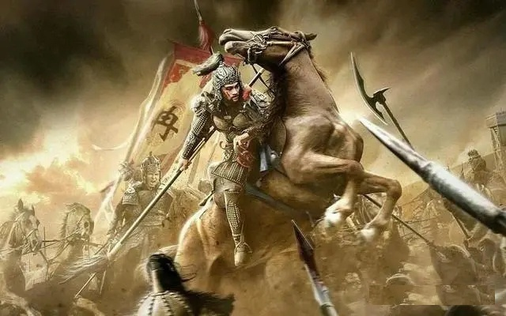
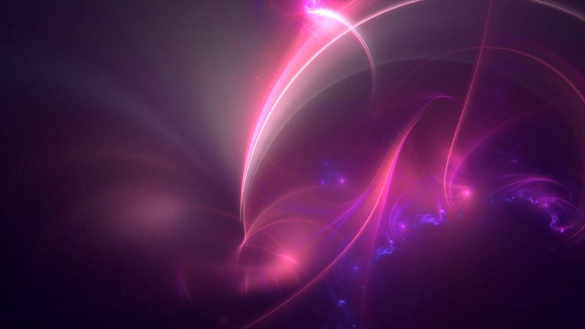
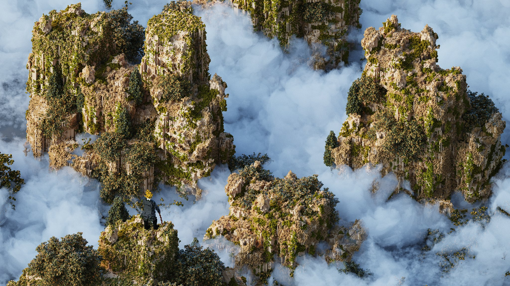
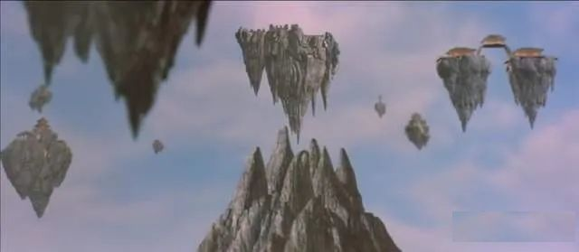
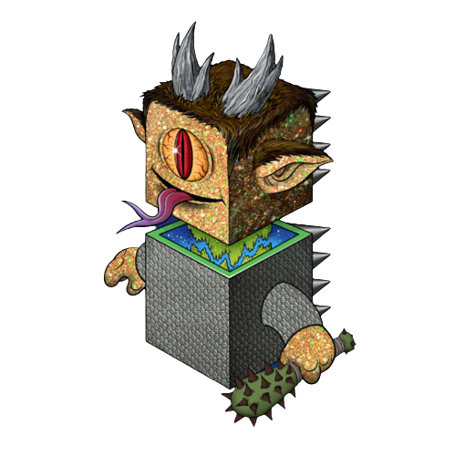

# The Initial Emergence of Mount Shu

In the autumn of the year 349, the night was as dark as ink. A group of horsemen galloped from the direction of Ye City, heading straight for the Western Shu camp of the Han army. The vanguard, Grand Commandant Li Nong, leaped off his horse and strode quickly into the central military tent, where the  emperor of ChengHan, Li Xiong, and his assembly of generals had been awaiting his arrival, the firelight casting flickering shadows. After paying his respects to the Emperor, Li Nong turned and slowly scanned the room before proclaiming with authority:

"By the decree of the Han ruler, all generals of the Han heed this order. By the command of General Ran Min, the 'Order to Kill the Xiongnu' is issued. The Xiongnu have brought chaos to the Central Plains. Now a proclamation is sent throughout the land, those who can join in the crusade against them, send your troops forth!"

Upon hearing the decree, the previously buzzing tent fell into a sudden silence. Li Xiong stepped forward, his presence commanding respect, and spoke in a deep voice: "Li Xiong of ChengHan, receives the command of the Grand General, to join in the crusade against the Xiongnu, to restore the Central Plains." His words ignited the passion of the generals like fire to hot oil, and a thunderous response echoed through the tent. Li Xiong immediately issued military orders, and the troops under the tent were placed under the unified command of the Grand Commandant, ready for deployment.

Pai Mei, since the age of eight, had been sent into the military camp by his uncle. Through ten years of life and death on the battlefields of this chaotic world, he had forged an instinct of caution, discernment of people and situations, ruthlessness, and relentless determination. He had become the most valiant young leader in the Han army, holding the rank of Commandant of the Cavalry.

At this moment, the "Order to Kill the Xiongnu" was like a spark igniting the long-suppressed fighting spirit within him. Pai Mei knew this was a heaven-sent opportunity to make a name for himself. However, thinking of the Central Plains ravaged by war and the uncertain fate of his loved ones, his heart was like being scorched by fire, restless and uneasy.

Pai Mei left the central military tent and returned to his own camp. After quickly issuing orders to his troops and making arrangements, he looked up at the night sky, saw the brilliant stars and the cool night, but his heart was still restless. He turned and walked towards the stables, saddled his horse, greeted the guard, and rode straight towards the foot of Mount Wa Wu.

Under the silvery moonlight, man and horse were like lightning, running extremely fast. In no time, they arrived at the foot of Mount Wa Wu, in front of a nearly vertical rock wall.

Before the horse had even stopped, the white figure leaped from the back of the horse, climbing up the rock wall through the cracks and crevices. In a short while, he reached a high point on the wall, paused briefly at a barely visible black crack, and then disappeared from sight...

About half a month ago, Pai Mei had led a cavalry squad to scout this location and accidentally discovered the entrance to the rock crevice. After passing through the crevice, they found a hidden world, a massive egg-shaped cave. The light column shining into the cave entrance stirred up dust, and the air was filled with the faintly salty smell of rock salt.

The site was treacherous and uniquely shaped, as if hiding secrets unknown to man. Could it be a place of cultivation carved out by ancient immortals? Pai Mei's mind was filled with curiosity, but due to military duties, he had to lead his team away hastily...

Tonight, by some strange impulse, Pai Mei returned to this mysterious cave. Under the moonlight, the narrow entrance on the rock wall seemed like the tightly closed mouth of a giant beast. Pai Mei entered sideways, passed through a narrow passage, and then felt the ground give way beneath him. His body slid into a huge egg-shaped space.

After a brief pause in the darkness, Pai Mei's eyes gradually adjusted to the environment. The surrounding darkness was not frightening but strangely peaceful. Pai Mei lay low, feeling the "breathing" of the entire cave. Vague vibrations came from below, as if there was a huge echoing heartbeat from the distant depths; it gave one a creepy feeling that this was not a rock cave but the inside of some giant living creature....

In the depths of the cave, a purple fluorescence flickered dimly. Pai Mei, transfixed by the strange light, slowly reached out to touch it. Under the fluorescence, a black cube outline faintly emerged.

Pai Mei cautiously reached out to touch the cube, feeling the recessed runes on the surface with tiny, prickly protrusions. He gently pressed, and a slight pain shot through his fingertip. In an instant, the barely perceptible purple fluorescence seemed to be infused with life, suddenly brightening and dancing with countless brilliant colors. The ground seemed to instantly bloom into a purple sea eye, bottomless, ever-changing, and incredibly gorgeous, like the awakening eyes of a goddess, with an indescribable charm.

The sea spring, radiant and lively, seemed as if it would drift away with the wind. Acting on instinct, Pai Mei made a grab for the flowing spring of light, but a sharp pain shot through his palm, and blood with a metallic tang gushed from the wound, flowing onto the cube.

Before he could pull back his hand, a strange sensation传来. In the flickering fluorescence, countless fine threads silently and swiftly climbed along the flowing blood, like fog, like wind, and like myriads of live black spore threads.

Suddenly, the fluorescence erupted with countless black threads, rapidly expanding into a vast black cloak that enveloped him from head to toe. Before he could react, the black threads penetrated every pore of his body, entering through the palm wound, nose, ears, and eyes.

Pai Mei screamed in terror, but he couldn't hear his own voice. All he could perceive were the countless black threads wriggling inside his body.

like trillions of nanometer-thin threads weaving through his veins, muscles, bones, and skull, causing unbearable agony that made him lose consciousness and faint...

Mount Wa Wu, with its solitary peak, stands to the west of Mount Emei, and its broad summit is as flat as a table. As the first light of dawn just began to emerge, the southwest corner of Mount Wa Wu, where the cave was located, suddenly shook violently. Rocks tumbled from the mountain, and dust billowed into the air. A massive black square mountain, akin to a titan, slowly rose from Mount Wa Wu, with strange blue light radiating from its base, ascending into the sky.

Bathed in the golden radiance of the morning light, the gargantuan square mountain gleamed with golden light, encircled by billowing mists, resembling a celestial peak from a mystical realm. In the distant Western Shu encampment, soldiers who beheld this astonishing spectacle stood agog or raced to spread the word, their discussions swirling amidst the camp.

Seated quietly in a niche of the command tent, a gaunt elder intoned softly, "Mount Shu emerges, and the Han house shall prosper."

The square mountain loomed like a Kunlun of the seas, basking in the golden sunlight, ascending higher and higher with the morning's glow, now above the clouds, and gradually drifting eastward towards Mount Emei in Shu, vanishing into the void above the Ten Thousand Buddhas Summit.

Pai Mei slowly regained consciousness and found himself lying on a ground that had turned into a translucent giant egg, with him positioned right at the center. As far as he could see, the ground around him suddenly became transparent and clear, revealing the precipitous Mount Emei's Ten Thousand Buddhas Summit below, as if a chilly mountain wind was blowing through. Frightened, Pai Mei retreated hastily, but then a foreign voice resonated within his mind: "Fear not..."

The voice appeared to emanate directly from his consciousness, with remarkable clarity. A flicker of curiosity stirred in Pai Mei's thoughts, prompting him to ask, "Who might you be? What location is this?"

The unfamiliar voice immediately responded, "Do not worry, I am a member of the divine dragon race from the distant heavens. You have awakened me. This place is my Original form, and currently, I reside within your corporeal form, now intertwined with your existence in symbiosis."

Pai Mei listened with a sense of vagueness, intent on finding a way to rise to his feet, only to find himself bound by an intangible force, unable to move.

The voice resonated once more: "Relax, follow me..."

As the voice guided, the ambient light gradually faded, and the egg-shaped cavern slowly morphed into a vast, limitless void of darkness.

Pai Mei felt as if he had lost his weight, his body gently floating upwards, spiraling into the abyss of the cosmos...

In the vast darkness, the Milky Way's nebulae slowly advanced, and in a flash, an incredibly radiant supernova explosion blossomed before him.

Unaware of the concepts of time, the universe, or galaxies...

Pai Mei felt himself transform into a minuscule mote of star dust, adrift in the infinite, dark void, traversing like a silver fish through eons of time and space...

Innumerable life images flickered before his eyes, endless evolutionary concepts continuously detonated within his mind, the multi-dimensional parallel universe's million-year war history flashed by, the rise and fall of the Dragon civilization occurred in a mere moment, immense light-speed curvature ships traversed the solar system's edge, and countless colossal, square DragonCapsules, ablaze, plummeted towards the solar system, the moon, and Earth...

On the ancient landmass, the roaming Jurassic dinosaurs were suddenly met with catastrophic doom, with innumerable colossal volcanoes erupting furiously in an instant...

In the blink of an eye, primitive humans began to stride upright across the savannah, clutching the first chipped flint tools in their hands...

The visage of the Dragon race's eternal life fleetingly passed, and an infinitely distant voice whispered through the void: "Integrate with carbon-based civilizations, break the curse of immortality."

Amidst this infinitely stretching, eternal darkness, Pai Mei succumbed to a profound slumber...
