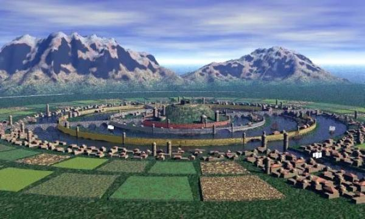
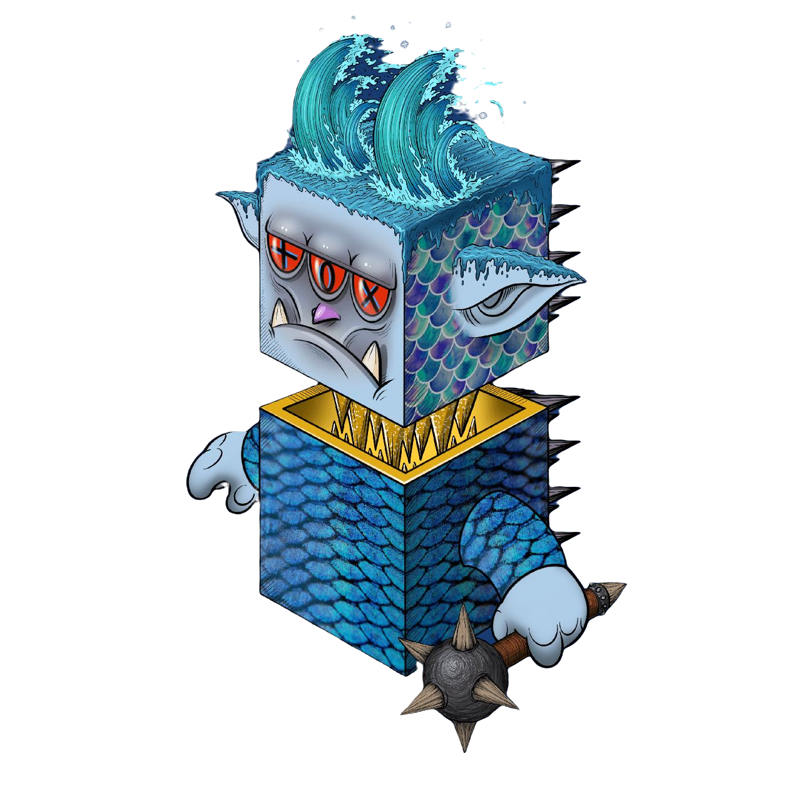

# Atlantis

"Atlantis", the name is first rarely seen in the dialogues of the ancient Greek philosopher Plato. Plato was a person from 427 BC to 347 BC. He wrote "Cretea" in his late years. In the two books, Timaeus and Timaeus, it is mentioned that—

"About 9,000 years ago in Solon, opposite the Pillar of Hercules (the Strait of Gibraltar), there was a large island from which you could go to other islands. block land, this is the kingdom of 'Atlantis'".

"Unbelievable, this city is made up of countless concentric circles, with two pyramids in the center. The streets and buildings in each concentric circle go diagonally into the sea. A 100-meter-high lighthouse was erected in the harbor and decorated with three cars. Sculpture of a carriage. The square has a gilded observatory, the palace of the sun god, the amphitheater and the arena, the ubiquitous public baths. The statue of Taurus in front of the pyramids, writing incomprehensible symbols

Arthur Curry, the son of the legendary fisherman, the prototype incarnation of Poseidon, the sea king in history, Arthur discovered the DC sea-wave-head on the bottom of the Atlantic Ocean while fishing inadvertently activated it with blood, and formed a DC Symbiont(called Sea-wave-head), The activated sea-wave-head is a giant Native form of Nature DragonCapsule, with more than 2 kilometers of body size, like an unsinkable island.

Arthur refers to the sea-wave-head as Atlantis in the history books. The legendary story of Arthur and the sea-wave-head has lasted for more than 300 years. With the accidental death of Arthur's beloved lover in the struggle of the empire, the glorious Atlantis civilization sunk into the depths of the Atlantic Ocean along with Arthur's sad slumber.

.jpeg>)
