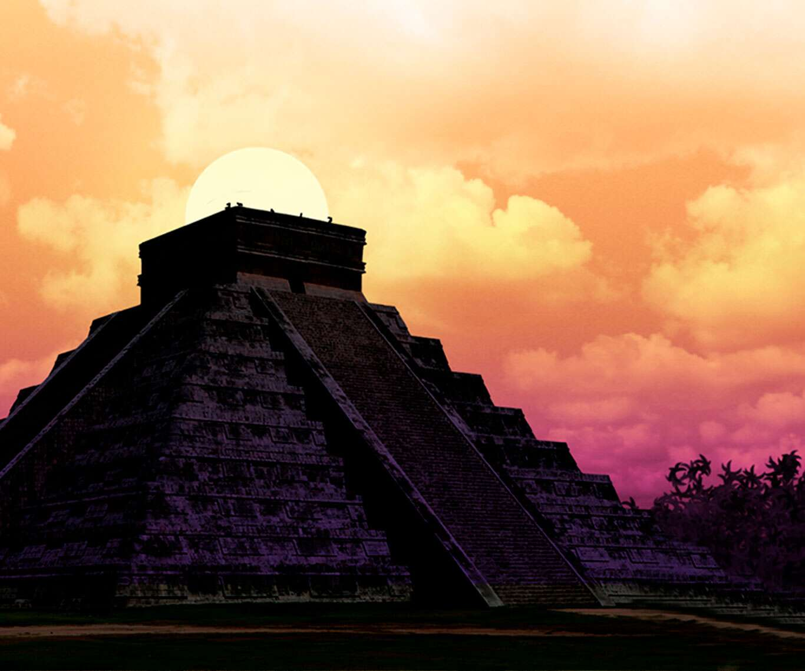
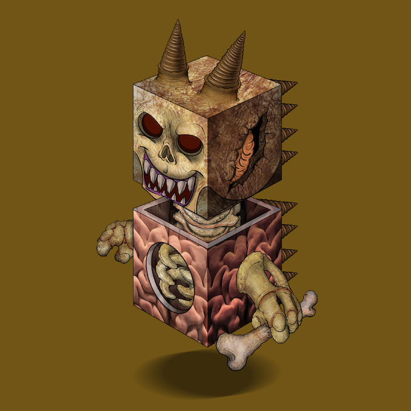
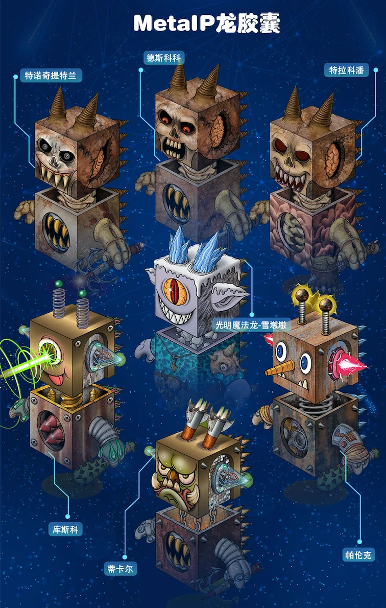

# Mayan Civilization

The Mayan civilization is one of the world's most famous ancient civilizations. It was born in the 10th century BC and reached its peak from the 3rd to the 9th century AD, which lasted for more than 3,500 years.

The ancient Mayans were recognized as great astronomers and architects, they called themselves "Zuo Jinxing" extraterrestrial visitors, the prophecies they had fulfilled, the slate paintings they created had scenes similar to "spaceships", and they orbited according to the stars Buildings built with mathematical and astronomical precision that would allow the first rays of the sun to shine through the center of the Sun Gate on September 21st of each year...leaving modern man countless splendid and colorful gems and many hard-to-decipher puzzle.

The Mayans believed in animism, and believed that gods traveled through the universe to guide people's lives. They worship the sun god, corn god, rain god, grain god, death god, war god, wind god, earth god, etc. They believe that these gods dominate people's farming and life in this world, and the sun god is the head of the gods. In order to win the promise of the gods and promote the prosperity of civilization, the Mayans chose to sacrifice human beings on festival days and hold grand memorial ceremonies.

The Mayan civilization has experienced ups and downs for three thousand years, and the last city-state ended in ashes in the cannon fire of the Spanish colonists. As the only ancient civilization in the world that was born in the tropical jungle instead of the river basin, the miraculous rise and development, decline and demise of the Mayan civilization are full of mystery. With the burning and destruction of Mayan documents, Mayan civilization has also been sealed in the long history like a puzzle through the ages.

In the 3rd century BC, on the Yucatan Peninsula in Mexico, a primitive tribe named Tiger teeth was being hunted by the Mayan protector of the panther. Huya ran for his life, but could not escape the pursuit of the black panther. In a desperate situation, he jumped into the deep pool under the jungle waterfall; Huya plunged into the bottom of the waterfall, and the blood on his forehead inadvertently activated the sleeping DC rainforest-head at the bottom of the pool. Tiger teeth and Rainforest-Head combine to form the Aztec, the dragon symbiote.

Technochititlan 's original form was a mid-sized skull dragon capsule with a length of more than 600 meters (Skull DC). Over the next eight hundred years, the bloodthirsty Tiger Fang and Technochititlan opened the Aztec civilization, and human sacrifice accompanied the glorious Mayan rainforest civilization. Multiple civilization city-states were nurtured by the ancient American Indians, including the Aztecs, as well as other dark skull dragons and quantum matrix robot dragons that were discovered, such as the Inca civilization and the Mayan civilization. However, as previously mentioned in the DragonCapsule Archives, due to the lack of protection from light natural dragon emissaries, the dark skull dragons and quantum robot dragons that symbiotically coexisted with the Mayan, Inca, and Aztec civilizations perished in their mutual struggle and fell back into deep slumber.

.jpeg>)

Around 800 AD, the city-states of the classical Maya civilization suddenly began to decline. Many cities were abandoned and the majority of once prosperous Maya cities were left abandoned in the midst of the jungle.
