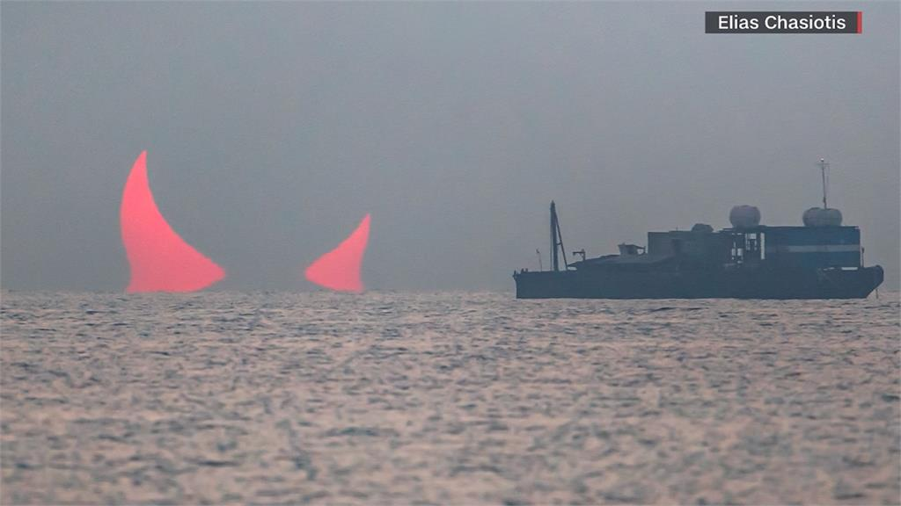

# Phantom of the Persian Gulf

In June 2024 the Persian Gulf, a "daily photo" released by the United States' National Aeronautics and Space Administration (NASA) has recently sparked global public discussion. The photo was taken by an astronomer in the Persian Gulf, but the image captured was described as "the red devil's horns." Experts have clarified that this was due to a solar eclipse.

NASA, FBI, and the China National Space Administration (CNSA) all received reliable information one day ago that the DC , SeaWave-Head, which had been activated by an unknown force, had been detected in the deep sea of the Indian Ocean and was moving towards the Persian Gulf.

The SeaWave-Head slowly emerged from the Persian Gulf, with huge waves sweeping across the sea surface, and a giant black cube-shaped object the size of a small mountain floated above the sea.

An imperceptible, powerful ultra-low frequency shockwave (infrasound) was emitted silently from the core of the SeaWave-Head, rapidly spreading across the vast Indian Ocean.

In the blink of an eye, the SeaWave-Head gradually became translucent, and disappeared from the ocean surface, with the horns transforming into the image of the red devil's horns in the Persian Gulf.
