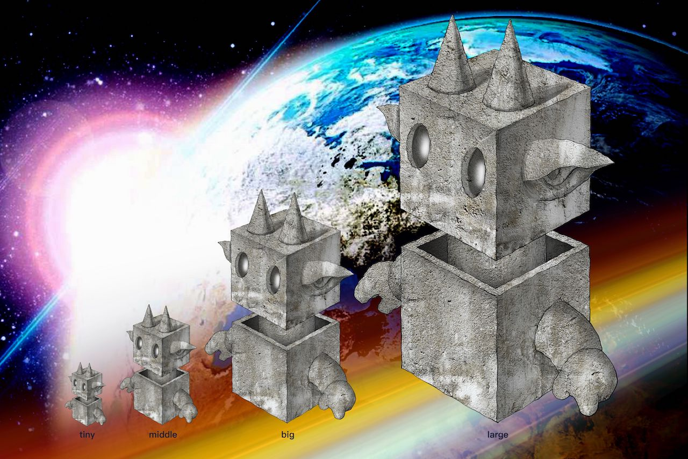

# Prequel Chronicles Of DragonCapsule Trilogy

#### _<mark style="color:orange;">中文版 -->--></mark>_[_《龙胶囊三部曲-前传编年史》_](https://dragoncapsule.gitbook.io/3story/)



> ## "There is a 'one in a billion' chance that we're living in a base reality"
>
> _**-- Elon Musk**   _&#x20;

<figure><figcaption></figcaption></figure>

### .Foreword

"DragonCapsule" is a huge metaverse sci-fi story composed of a multi-dimensional cosmic civilization and the legendary story of the earth. This is the first DAO driven, multi-person collaborative creation, spanning the time, space and history of the earth.

### **.S**tatement

1. "Prequel Chronicles of DragonCapsule Trilogy" is the leading storyline of the DragonCapsule Trilogy. It is presented in the form of a chronicle. It does not involve the development of the story or character building. The original team reserves the importance of the future stories of the "DragonCapsule Trilogy". The right to construct, add, delete and modify, and does not represent any restriction and commitment of the official original team to the creation of the "DragonCapsule trilogy" sci-fi works.
2. The creative team of "Prequel Chronicles of DragonCapsule Trilogy" is from the United States, China, Singapore, and Japan; through remote collaboration, the universe of DragonCapsule will be created together; with the development of the subsequent works of "DragonCapsule Trilogy", priority will be given to the country where the storyline is located. The author participates in literary re-creation.
3. All contents of "Prequel Chronicles of DragonCapsule Trilogy" are purely fictitious and do not involve any political orientation. They are complete and independent science fiction works with independent copyright and intellectual property protection.

### .DragonCapsule Trilogy

"DragonCapsule Trilogy" is a huge metaverse sci-fi story IP composed of a multi-dimensional universe civilization and the legendary story of the earth. It is also the first true metaverse science fiction novel. The whole book is divided into three parts.

* **1. "Dragon Capsule"**
* **2. "DomeLand"**
* **3. "Final Fantasy**

### **`.`**Official Links

1\. Website: [https://yielddao.io/](https://yielddao.io/)&#x20;

2\. Twitter : [https://twitter.com/www\_yielddao\_io](https://twitter.com/www\_yielddao\_io)\

### **`.NFT MarketPlace`**

OpenSea : [https://opensea.io/collection/dragoncapsule](https://opensea.io/collection/dragoncapsule)

### **`.Chinese Version（中文版）`**

中文版 : [https://dragoncapsule.gitbook.io/3story](https://dragoncapsule.gitbook.io/3story)

