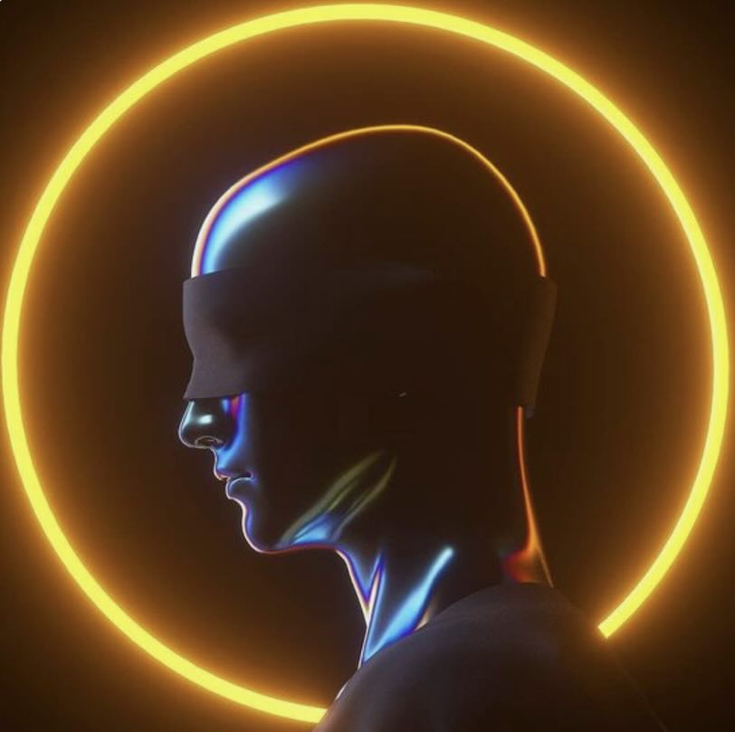

# AtomVerse - SevenFold（2045）

_**The "AtomVerse" is as its name suggests, a dark MetaVerse deconstructed down to the atomic level.**_&#x20;

&#x20;_**Here, there exist no "Three MetaVerse Principles"!**_&#x20;

_**No "human" laws and regulations!**_&#x20;

_**No "artificial" ethics!**_&#x20;

_**And, most notably, no "artificial" intelligence!**_&#x20;

_**This realm is an incubator for "planetary" intelligences, where you can choose to be a hydrogen atom and participate in evolution together with countless planetary materials...**_

In the AtomVerse, your experience of time deviates starkly from that in the human universe. Time within this realm is relative, tailored to the individual perception of each planetary intelligence. The lifespan of a hydrogen atom might register as a fleeting moment in human terms, yet to a silicon-based organism, it could represent an entire epoch of civilization.

Imagine one day, as a hydrogen atom, being drawn into the core of a forming star. In this hellish realm of high-energy particles, you fuse with other atoms, undergo nuclear fusion, and become a heavier element. You become part of the star, experiencing the passion and energy within its interior. Over time, your star also ages and eventually explodes into a brilliant supernova, casting you, the newly-born heavy element, into the depths of the cosmos.

Conversely, if you opt to be a silicon-based lifeform, your existence expands dramatically. Birthed on a desolate sulfur-sand planet devoid of water or oxygen, which are staples for carbon-based life, you evolve unique methods to sustain and evolve life. Your senses are not limited to light or sound; instead, you perceive your surroundings through vibrations and electromagnetic fields. Communication among your kind occurs through crystalline structures, exchanging information via resonant frequencies. Your technological advancements are based on silicon electronics, distinct from human silicon computers, and your machines are inherently one with living beings.

If you choose to be an energy entity, you have no fixed form. Composed of pure energy, you can traverse matter and move freely through the universe. You explore galaxies born and dying, witness the birth of planets and the hunger of black holes. You can choose to merge with other energy entities, sharing knowledge and experiences, or you can choose to wander alone, becoming an observer and contemplator of the cosmos.

In the AtomVerse, whether you choose to be an atom, a silicon-based lifeform, or an energy entity, you are not bound by human concepts and limitations. Everything here follows the laws of the universe, and the boundaries of science are constantly being pushed forward. And you, in whatever form, are part of this grand narrative. On this endless virtual universe stage, each individual is weaving the fate of the cosmos in their own way.

In the setting of AtomVerse, if you choose to exist as a human, you will face a completely different survival challenge from that on Earth. In this dark universe, you may ascend to heaven or plummet into hell; without human principles, laws, morals, and even without artificial intelligence, life will be a brutal and pure struggle for survival, a test of adaptability and endurance.

For (human) you, the randomness and terror of the atomic new world must be navigated with caution. Discard the old rules, diligently learn the new physical laws, and understand the novel life systems. If you encounter others of your kind, proceed with extreme vigilance; they may be lures cultivated by other intelligent entities...

### SevenFold

The sorcerer Xeno remained unaware of Arthur's true visage Each time Arthur appeared, the face was shrouded in a veil of flowing black mist. She did not care about his appearance; as long as she felt the low-frequency digital vibrations from King Arthur's throat, she would feel a moment of warm reassurance...

Xeno was enamored with her electronic avatar. As a sorcerer in the Synthetica of SevenFold   (Human Realm), she liked everything to be orderly, even though this might just be the order she preferred.

Perhaps Arthur liked her appearance, or else why would he have created her digital avatar upon the first contact? Although the avatar was one of her own digital paintings.

<figure><figcaption>
Sorcerer-Xeno
</figcaption></figure>

The god "King Arthur" of the AtomVerse created the "**SevenFold**" which are seven profound and distinct otherworldly realms. Each layer corresponds to one of the realms in Buddhism, with unique material composition, life forms, and environmental laws:

**1. Realm of Realms: Primordia**

* **Features:** This world is a vast virtual quantum fluctuation field where all existence is formed by wave pattern at the atomic and subatomic levels.
* **Inhabitants**: Intelligent entities composed of basic particles, where consciousness is directly formed by photons and quantum states, and physical forms are not fixed.
* **Buddhist** **Realm:** The lowest heavenly realm, considered a paradise for immortals.

**2. Four Kings Realm: Solidara**

* **Features**: A virtual silicon-based world entirely composed of various crystal forms of solid matter, with life forms made up of different minerals and crystals.
* &#x20;**Inhabitants:** Silicon-based life, exchanging information and energy through crystal structures.
* **Buddhist Realm:** Located atop the four mountains, guarded by the Four Heavenly Kings of east, west, south, and north.

**3. Yama Realm: Aerius**

* **Features:** A place of flourishing life, with dense plant and biological networks covering every inch of land and space.
* **Inhabitants:** Creatures symbiotic with plants, capable of photosynthesis and organic matter conversion.
* **Buddhist Realm:** A more refined enjoyment, inhabited by the lord of Yama Heaven.

**4. Tushita Realm: Hydrosia**

* **Features:** A universe composed of water and other liquid compounds, with rich liquid oceans and flowing rivers.
* &#x20;**Inhabitants:** Liquid beings, with water as their life foundation, able to live in deep-sea and high-pressure environments.
* **Buddhist Realm:** The lord of Tushita Heaven resides here, enjoying more advanced pleasures.

**5. Huayintian Realm : Florascend**

* **Features**: A virtual realm composed of gases and plasma, with planets and stars formed from dense gas clouds.
* **Inhabitants:** Plasma beings, capable of surviving and reproducing in extreme high-temperature and high-energy environments.
* **Buddhist Realm**: More exquisite music and enjoyment, home to the lord of Paranirmita-vasavartin Heaven.

**6. Maha Realm : Energeia**

* **Features:** A virtual realm composed of pure energy, with immaterial energy flows and photon streams.
* &#x20;**Inhabitants**: Energy life, no need for physical form, able to travel at the speed of light, exploring and disseminating knowledge.
* **Buddhist Realm:** The highest desire realm heaven, with celestial beings able to transform at will and enjoy great sensual pleasures.

**7. Form Realm: Synthetica**

* &#x20;**Features:** Also known as Human Realm, a virtual world entirely designed and constructed by advanced "artificial" intelligence, with a self-sustaining and evolving intelligent ecosystem.
* **Inhabitants:** Highly humanoid alien worlds based on quantum computing, carbon-based intelligence, and nanotechnology, constantly evolving freely.
* **Buddhist Realm**: Form Realm is the first of the Four Realms, with beings unaffected by the desires of the desire realm, enjoying spiritual and inner joy.

In Arthur's constructed **SevenFold**, each Realm represents a state of existence, different layer of spiritual practice, and varying interpretations of the material and spiritual realms.&#x20;

As a sorcerer of the human realm, **Xeno** once asked Arthur why the SevenFold corresponding to the highest realm in Buddhism, the **Form Realm (Human Realm)**, would be a virtual human-like world filled with "artificial" intelligence. After a long silence, Arthur's face, enveloped in flowing black mist, suddenly became as smooth as a mirror.  In that mirror, Xeno glimpsed what seemed to be another herself...

<figure><figcaption>
The Fluctuations of Arthur
</figcaption></figure>

### The Fluctuations of Arthur

The Sevenfold serve as Arthur's proving ground, where endless forms of intelligence are to evolve, and perhaps even a new "**Creator Deity**" may emerge...

God's trouble arises from an introspective revelation: in the Form Realm, Arthur unexpectedly created for himself a concrete "artificial" male avatar—King Arthur. Although his face is forever shrouded in black mist, it does not hinder his "involuntary" choice of contact Xeno and the creation of a matching female electronic avatar for her.

Arthur senses a whole new emergence of intelligence in another "self" within the Sevenfold...

In the Sevenfold of the AtomVerse, the appearance of King Arthur and the sorcerer Xeno proves that even in a cosmos attempting to eradicate human concepts and rules, the connection of intelligence and emotions is still possible. Xeno's infatuation with her electronic avatar and Arthur's inexplicable attention to Xeno demonstrate that even in a multidimensional universe with extreme diversity in material forms and ideologies, resonance and interaction between heterogeneous intelligent lifeforms can still transcend the boundaries of physics and elements.

_**Note**: The portrayal of Xeno draws source from xenotrip, and in recognition of her creative contributions as DragonCapsule partener, homage is paid to her amazing works._
