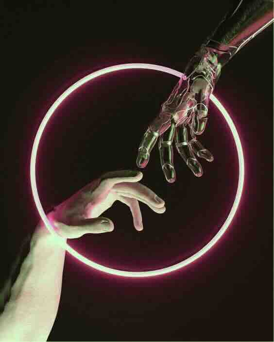
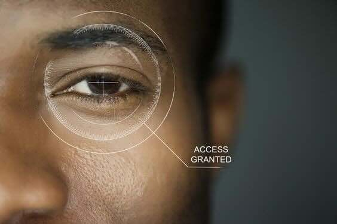

# Data Mining (2068)

As time entered the second half of the 21st century, **"Real Data"** has become the true gold mine.

"**Real**" here has a dual meaning:

* Data originating from the real world _**(RWD or RWDA)**_
* Data that is neither artificially synthesized nor directly or indirectly generated by AI _**(Non-Generated Data)**_

Following the AI singularity catalyzed by ChatGPT3.5 in the early 21st century, sovereign AI swiftly emerged as the predominant trend in AI development across nations. This new industrial revolution in AI is focused not on the production of energy or food, but on the generation of intelligence, with every nation needing to cultivate its own intellectual output—sovereign AI.

Nations are now compelled to leverage their unique datasets—encompassing culture, history, knowledge, and social intelligence—to refine their sovereign AI systems. _**Artificial intelligence has emerged as a crucial driver of economic transformation,**_ and the underlying factor in this shift is the intense competition for _**control over sovereign-AI, Real Data.**_

<figure><figcaption>
AO laid the foundation for the birth of super-sovereign AI
</figcaption></figure>

In 2024, with the emergence of the AI singularity, Sam created the _**AO Global Data Network (AI-Oriented Global Data Network),**_ an eternal network that consumes all human data, and deployed the revolutionary decentralized super parallel computing framework AOC 1.0 on this eternal data network, becoming the cradle for the birth of human super-sovereign AI.

By 2035, with the advent of General Artificial Intelligence (AGI) and the early _**Fully-Immersive Metaverse,**_ Generated Data had become a plague, with most of the interactive games people played, TV program content they watched, conversations with virtual digital companions, and even business negotiation decisions... all coming from **AI-generated real-time data**. Genuine human communication in the real world had become increasingly rare and precious.

the burgeoning bigest black market for real human data evolved from the AO perpetual data network. In this clandestine marketplace, every true human served as a precious data mining machine, ceaselessly producing valuable human data that was then sold at premium prices in the data market; however, 90% of these transactions were illicit or conducted without the authorization of the individuals involved.

The United Nations _**Data Privacy and Human Rights Commission**_ had passed a multilateral resolution five years prior, banning the third-party brokerage of individual authentic data. Yet, enforcement proved futile. The colossal interests of the AI industry propelled the global underground data trade across sovereign regions.

In 2039, AO's early founding elder _**Oprog**,_ keenly seized this opportunity and launched the _**Real Data Network (RWDN)**_ resistance organization.&#x20;

The modus operandi of _**RWDN**_ is straightforward; it operates as a P2P decentralized network of genuine human data. Behind each node lies a human miner (HN). At irregular intervals (3 hours, 2 days, 1 week, or fortnightly), human miners undergo a comprehensive biometric scan by RWDN, encompassing _**Iris, Deep Video, and DNA (saliva, hair...) as the three pivotal biometric identifiers.**_ Only those human nodes that successfully pass three consecutive biometric scans are authorized to produce digital signed _**Real Human Data (RWHD)**_ that meets the requirements for various applications.

<figure><figcaption>
RWDN human biometric holographic scan
</figcaption></figure>

RWDN amalgamates AI/human identity verification and recognition, a distributed perpetual data network, C2C digital object marketplaces... and numerous other pivotal elements, solidifying its status as the most critical infrastructure within the AI sector. It ensures that AI and human identities can undergo zero-knowledge verification at crucial commercial junctures.

After 2045, with the expansion of the jurisdiction of the United Nations Data Privacy and Human Rights Commission, AI identity proactive identification technology became an international law-regulated technology banned in the MetaVerse, representing unprecedented progress and enhancement in the moral and ethical legislative process of AI artificial intelligence promoted by the human minority in the MetaVerse.

Real human data, in a C2C model, is being traded on a large scale between global human miners and data buyers in compliance with the regulations of the United Nations Data Privacy and Human Rights Commission and international law; the huge demand for real data has made RWDN the unicorn of the global real data mining industry, and super-sovereign AI based on AO and RWDN is also quietly sprouting and growing rapidly.

The strong rise of the **Real Data Network (RWDN)** resistance organization has caused great concern among some sovereign states and other competitive organizations about its monopoly position. RWDN eventually becomes the real data mining empire, monopolizing 70% of the global super-sovereign data market share, but it is unwilling to restrain itself proactively. A minority of vested interest groups have influenced the voting decisions of DAO, and RWDN gradually stands against the global human miners. The dragon-slaying youth has become the evil dragon, and a real black storm is brewing...

<figure><figcaption>
RWDN Data Mining Empire
</figcaption></figure>

Concurrently, within the public MetaVerse and the dark MetaVerse, _**Data Pirate**_**s** have become a major force, with their activities dominating the underground data black market. These data pirates typically possess robust technical expertise and computational resources, enabling them to swiftly identify vulnerabilities in the human biometric holographic scanning technology epitomized by RWDN. Employing a range of unconventional tactics, they illicitly harvest human data and pilfer identities for illegal trade. The underground human data industry flourishes in tandem with the growth of the RWDN network, much like the duality of night and day, claiming both the luminous and shadowy facets of the AI industry within human society.

_**Note：**Real-World Data, synonymous with Authentic data , is prized for its purity and reliability, as it is not derived from human fabrication or generated by artificial intelligence._
