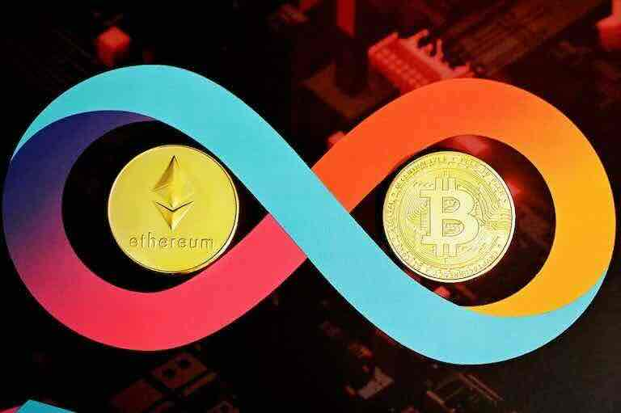
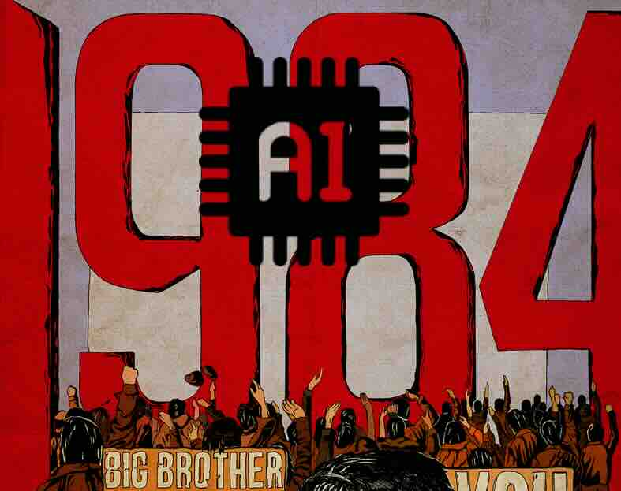

# The Ascendancy of Crypto Economy (2009-2109)

### Establishment of Dollar Supremacy (Sovereign Currency)

The story begins in 1944 with the Bretton Woods Agreements, which established a new international monetary system, commonly referred to as the "Bretton Woods System". This system solidified the dominant position of the US dollar in the global monetary system, ushering in a new era of modern currency.

On August 15, 1971, Nixon announced the decoupling of the dollar from gold, marking the collapse of the Bretton Woods System. Despite strong opposition from European countries to the United States' unilateral violation of the agreement, they were powerless to prevent it. The Smithsonian Agreement in 1973, which attempted to maintain fixed exchange rates, also failed. From 1974 onwards, Western countries adopted a floating exchange rate system.

The new system was a dollar standard. Under this system, the dollar became the true international currency standard, the central currency, and the sovereign currency hegemony, no longer backed by any precious metals. The dollar became the most important foreign exchange reserve for countries and became the most successful currency of the 20th century.

<figure><figcaption>
The Bretton Woods system established the hegemony of the U.S. dollar as the global sovereign currency
</figcaption></figure>

### The Ascendancy of the Crypto Economy (Non-sovereign Currency)

A review of contemporary human history reveals a fascinating alignment: cryptocurrencies have been present through every pivotal juncture in the evolution of artificial intelligence.

In 1976, Friedrich Hayek, the distinguished economist, penned his ultimate economic treatise, "The Denationalisation of Money". This modest work was brimming with visionary insights, introducing for the first time a holistic concept of free-market currency competition; yet, Hayek could not have foreseen that the central player in this transformative drama would be the digital currencies hailing from an entirely different dimensional space

The year 2008 marked the inception of Bitcoin by the enigmatic cryptographer, Satoshi Nakamoto (satoshi.nakamoto). With the Bitcoin network, an encrypted digital currency, Nakamoto quietly set forth the crypto-financial revolution, advocating for a Bankless society and the denationalization of money.

Fast forward to 2022, with the advent of ChatGPT 3.5, the era of the early AI standard "Turing Completeness Test" was declared over, and artificial intelligence stands on the precipice of AGI (Artificial General Intelligence) transformative growth.

Entering January 2024, within the diverse landscape of the AI-driven digital economy, the U.S. Securities and Exchange Commission (SEC) sanctioned the listing of the spot Bitcoin ETF. The "BTC", now in its nascent form as the sovereign of global digital currencies, exemplifies the complex and intertwined relationship between AI-powered digital economies and cryptographic digital currencies.

The Wall Street magnates have perceptively acknowledged this nascent entity and are actively seeking to propel and dominate the new digital economy propelled by artificial intelligence. Cryptocurrencies, emblematic of this revolutionary shift, have grown to be the elephant in the room, an influence so profound that it can no longer be overlooked.

<figure><figcaption>
The Ascendancy of the Crypto Economy
</figcaption></figure>

In the near future, the principal global players have come to recognize that the crypto economy is fostering the emergence of a digital currency hegemony that transcends national boundaries, and the curtains have just risen on a new era of digital financial contention.

Once again, the Wall Street financial magnates stand as the vanguard of capital deployment, charting an unmistakably clear trajectory for the national currency system: "Gold Dollar -> Oil Dollar -> Bitcoin Dollar". This progression is driving the perpetuation of dollar supremacy in the realm of artificial intelligence-powered digital finance technology.

In swift succession, key economic entities such as Russia, China, Japan, the United Kingdom, Canada, Australia, India, the European Union, Southeast Asia, Arab nations, Africa... are diligently establishing sectors in artificial intelligence, advanced renewable energy, high-end technology manufacturing... as well as regulatory bodies focused on the development and research of the digital economy, exerting their efforts to integrate artificial intelligence and the digital economy with capital from traditional industries. They are hastening to secure a dominant position in the discourse and strategic resources of the global digital finance era...

### The Age of Supranational Currency

By the year 2055, Bitcoin's market capitalization had surpassed 1000 trillion US dollars, solidifying its position as the premier supra-sovereign digital currency on a global scale. At this time, Bitcoin had undergone a magnificent transformation, The native Bitcoin retained the POW algorithm, but its computing power had evolved to quantum computing miners, leveraging bio-genetic computing platform technology and embedding AI algorithms capable of resisting quantum encryption.

The Bitcoin blockchain system had transformed into the foundational financial settlement layer for the worldwide artificial intelligence network. A multitude of Bitcoin sub-networks, known as Layer 2, Layer 3...Layer X, and beyond, flourished, with 'colored Bitcoins' being actively exchanged across these layers for diverse digital applications. The original Bitcoin was pledged as collateral within the underpinnings of the primary AI financial infrastructure systems, making the circulation of genuine Bitcoins exceedingly rare. Possessing a single original Bitcoin was a mark of immense wealth.

These colored Bitcoins thrived, being swiftly exchanged across second and third layers and indefinitely derived encrypted networks for a myriad of digital applications. They spawned an array of unconventional AI financial derivatives known as Defi, which were subject to automated trading and settlement via AI systems. The value of these derivatives could surge by tens of thousands of times in an instant or plummet by thousands of times overnight, even reaching zero.  All of this is underpinned by the highly developed AI-driven, Fully-Immersive Metaverse tech of nations.

Similar to the Bitcoin network, Ethereum withstood the challenges posed by numerous contenders dubbed 'Ethereum killers'. It successfully evolved into a Layer 1 decentralized foundational computing network, hosting countless domain-specific AI logic applications that operated with automated computation and execution (referred to as Layer N). An endless stream of data, AI applications, and digital assets continuously functioned on this network without cease.

<figure><figcaption>
Large and Small Magellanic Clouds
</figcaption></figure>

The Bitcoin and Ethereum systems are like two nebulae that are satellites to each other: the Large Magellanic Cloud and the Small Magellanic Cloud, orbiting around our "Milky Way" - the all-encompassing MetaVerse economic system. An infinite number of wormhole channels connect these two vast cryptographic networks, facilitating a relentless interchange of data, currency, and energy.

### AI Digital Life

<figure><figcaption>
British writer George Orwell wrote the classic political absurd science fiction novel "1984" in 1949.
</figcaption></figure>

Within the comprehensive Fully-Immersive MetaVerse economic framework, the colored Bitcoins led by Bitcoin and the derivative Tokens led by Ethereum have emerged as the supra-sovereign currencies of the virtual digital realm, driving the economic engine behind the all-encompassing MetaVerse to thunder continuously...

Come 2085, the MetaVerse has become the primary choice for people's work, leisure, and even electronic sexual activities. As the relative growth rate of economic activities in the physical world declines annually, the relative GDP of the MetaVerse has seen an exponential rise. Humanity is on the cusp of fully transitioning into the digital financial era of the MetaVerse, where for the first time the value produced by the virtual economy has historically eclipsed that of the physical economic industries.

Artificial Intelligence has supplanted over 90% of fundamental  jobs. In conjunction with a marked decrease in birth rates, by 2100, the global actual population has steadily contracted to approximately 7 billion.

In tandem with this demographic shift, the year 2100 witnessed a milestone event of profound historical portent: "For the first time in history, the number of globally AI-driven and legally recognized digital  lives has surpassed the 100 billion threshold..."

