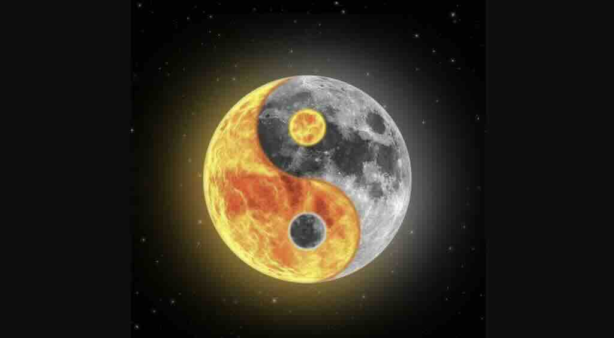

# The Road to Evolution (2102)

The rapid development of Metaverse and AI has gradually formed _**two main construction paths**_ for the MetaVerse:

1. **Simulated Metaverse:** This path involves extensive training with artificial data and reinforcement learning to simulate cosmic evolution _**(evolution through simulated learning).**_
2. **Modeled Metaverse:** This approach entails the establishment of a foundational universe model and the construction of a basic particle model, allowing for free evolution and data-driven interventions _**(self-evolution of the model).**_

The execution of metaverses is often intricate and involves a blend of methods, yet a pivotal question persists: which path forms the foundation, and which serves as the supplement.

The selection of the critical path is of utmost importance, to the extent that the evolution of metaverses, in the process of being actualized in society, has inevitably diverged into two distinct disciplines: Artificial Intelligence and Universe Modeling.

Only a select few who have insight into the top-level design understand that behind the cross and parallel development of the two disciplines lies a single ultimate goal….

### 1.  Simulated Metaverse&#x20;

_**Simulated Learning Path (Artificial Universe & Artificial Intelligence AI)**_

The notion that machines should possess _**learning ability**_, representing the most profound foundational concept in the realm of artificial intelligence for humanity. As Turing once posited, if a deity crafted humans in its own likeness, and now humans have replicated this process with artificial intelligence, then _**if the divine possesses a soul, so too do humans and AI.**_

There are assertions that artificial intelligence will ultimately transcend and supplant humanity. How should this notion be considered? From whom is the machine learning? The machine, in every moment, is learning from humanity, with AI scouring the internet for vast datasets, perpetually forming its own cognitive benchmarks through the learning process. Should human vices of "greed, deception, and conflict" overshadow virtues of "compassion, kindness, and peace," it can be concluded that AI will inevitably mirror such tendencies. Yet, if we uphold scientific principles, embracing "truth, goodness, and beauty" as the guiding principles of behavior, and value life and peace; AI too will reflect these principles……

_**The ultimate fate of humanity hinges upon our aspirations, for the kind of people we strive to be is the mold into which AI will be cast. We are, in essence, the archetype for AI !**_ In this light, the essence of artificial intelligence is ultimately a "_**game of mimicry.**_"

### 2.  Modeled Metaverse&#x20;

_**Self-Evolution Path (Self-Evolving Universe & Non-Artificial Intelligence - NAI)**_

&#x20;It is widely understood that the fabric of the universe likely cannot be infinitely subdivided, with the Planck length and Planck time representing the smallest measurable scales and durations. Below these thresholds, spacetime exhibits discrete properties, such as in quantum space. Within the quantum spacetime framework, matter exists in quantum states, with position and momentum information adhering to the Heisenberg uncertainty principle, manifesting in probabilistic distributions.

Our world is far from perfect. Above the tangible reality of our existence lies a metaphysical realm of perfection, where lines are unequivocally straight and circles are perfectly round. Constructed from absolute geometric forms, this idealized world can be termed the Geometric Universe. _**The Geometric Universe establishes an eternal model of the cosmos,**_ unbound by the constraints of the physical world and transcending the dimensions of time and space.

### The Construction of Modeled Universe

Arthur's initial foundational principles for the self-evolutionary modeling of the universe are rooted in _**Euclid's "Elements."**_

Arthur holds great respect for the German philosopher Kant, who "with mortal eyes, perceived the secrets of the universe," and adheres Kant's philosophy. Arthur establishes a fundamental premise in philosophy for the AtomVerse : _**it is forever impossible to perceive the truth of the universe's essence**_.

In other words, "the world cannot be correctly perceived by senses." Each object has a unique essence, and because human (or any intelligent entity) perception is limited, it is impossible to truly understand its essence.

Thus, all things in the virtual universe can be divided into dualities:

* **Phenomenon (Yang):** This part is the material appearance, that is, the macro and micro manifestations of the universe reflected by fundamental particles. Phenomena can be observed and recognized.
* **Noumenon (Yin):** This part is the material essence, that is, the geometric structure and fundamental particle composition of the universe. The noumenon cannot be directly perceived.

<figure><figcaption>
Dualities  Universe - <strong>Yin &#x26; Yang</strong>
</figcaption></figure>

In the 2010s, the Swedish prodigy game designer Markus Persson crafted the iconic game "**Minecraft**." Arthur, too, found considerable enjoyment in the virtual realm of "Minecraft."

Arthur thus designed the virtual world to be constructed from **5 basic virtual particles**. Although these five basic virtual elements are constructed by Arthur from a philosophical and abstract perspective, these five fundamental "particles" are closely related to the concepts of modern physics and can be easily mapped to entities or concepts in modern physics theories:

1. **Geometron Particle** - In modern physics, space geometry can be described by general relativity, where gravity is caused by the curvature of spacetime (geometry). In quantum gravity theories, spacetime can be quantized, such as in loop quantum gravity, where space can be seen as composed of "loops," and in string theory, it might be composed of "strings." Geometron is the basic unit that constitutes the geometry of spacetime.
2. **Mattertron Particle** - In the standard model, matter is mainly composed of fundamental particles such as quarks and leptons (including electrons and neutrinos). Matteron can be seen as a general term for these fundamental particles, which constitute the material world we can directly perceive.
3. **Energon  Particle** - In physics, energy is not carried by some "particle," but can be transmitted by particles such as photons (mediator particles of electromagnetic force). In some modern theories, such as string theory, all particles are manifestations of energy in different vibrational modes. Energon can represent the behavior or state of these particles when transmitting energy.
4. &#x20;**Infotron Particle** - Information plays a fundamental role in quantum mechanics, especially in quantum entanglement and quantum computing. Information can be seen as a state of a physical system or a part of a quantum state. Infotron can symbolically represent qubits, or the concept of entropy.
5. **Observon Particle** - The observer effect in quantum physics shows that there is a fundamental interaction between the observer and the observed system. Observon does not correspond one-to-one with real-world physical particles; it can represent the role of the observer in the appearance part or measurement process (such as **photons**, wavefuntion, entangled particles...).

### The Way of Cosmos

From a graph-theoretic perspective, the atomverse is an infinitely expanding Directed Acyclic Graph (DAG) in spacetime, and its irreversibility (directedness) dooms it to be an entropy-increasing universe. The system's entropy (a measure of disorder) grows infinitely with the expansion of the DAG.

Considering the currently observable universe, the energy of the universe is not infinite. Each star system is a closed energy system that will eventually die due to the depletion of energy resources. Even black holes, which can devour stars, will gradually lose energy and mass due to black hole evaporation, as described by Hawking's radiation theory, until they completely evaporate. The law of entropy increase still applies to the atomverse, it is a penetrating rule that does not even need simulation.

The theory of human evolution, which charts a course from disorder to order, appears to clash with the entropy increase law's depiction of a transition from order to disorder. _**Erwin Schrödinger,**_ in his seminal work "_**What is Life?**_", introduced the concept of organisms maintain and increase order amidst an entropy-increasing universe, thus perfectly integrating the principles of evolution with those of entropy increase.

Organisms are no different from any other matter; they also follow the principle of entropy increase. Inside an organism, entropy continuously increases, and disorder continuously rises. When entropy reaches its maximum value, it represents the death of the organism.

So how can an organism avoid death? That is, to fight against entropy increase, and the way to fight entropy increase is to intake _**negative entropy**_ from the surrounding environment. Positive entropy represents disorder, while negative entropy signifies order.

Arthur designed the underlying drive for the intelligent evolution of the SevenFold virtual universe in the Atomverse: _**Resisting Entropy Increase,**_ which is also the underlying game rule of the atom universe, in other words: the "_**Way of Cosmos.**_"

_**The Way of Cosmos - to summarize in one sentence, it is to "Create Order" as much as possible.**_

We see that humans have been consuming a large amount of energy, and human history can be simplified into a history of energy development. How does this irreconcilable contradiction with the inherent trend of entropy increase in the universe come about?

This is because life is unwilling to be limited by the universe. Humans hope to pass on their genetic code and all the information order they have created, and humans constantly develop technology and explore the secrets of the universe, hoping to break the laws of the universe and challenge the ultimate fate of Heat Death of the Universe.

The Way of Cosmos is the underlying drive designed by Arthur for the modeled metaverse and its evolution: the emergence and evolution of intelligent entities, resisting entropy increase, creating order.

_**As the "I Ching" states, "Heaven's movement is ever vigorous, and the superior man should constantly strive for self-improvement"... "Qian" hexagram.**_

