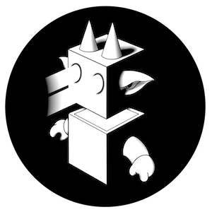

# Eternal Darkness (2989)

### _**》》 Prequel: The Final Chapter**_

Whether immortal humans remain humans or have evolved into a new species is a subject of contemplation.

Throughout the ages, symbiotic beings have observed it all, pondering the meaning of existence: "Are we still Humans? Dragons? Or an entirely new species beyond comprehension?"

Humans themselves are also reflecting: "Have we opened a new world or unleashed an eternal darkness from Pandora's Box?"

This inevitably brings to mind a long-standing historical question:

> #### What led to the demise of the immortal Dragon race?&#x20;
>
> ####
>
> #### Let us journey back to the Gamma Epoch, 1.98 million years ago, and explore the depths of the Dragon Galaxy in the superstring cosmos....
>
>
>
> #### Perhaps the answer lies beyond the horizon**！！！**

<figure><figcaption></figcaption></figure>

_As the prequel journey draws to a close, the Humans and Dragon race find themselves standing at the precipice of destiny. The culmination of their trials and tribulations has led them to this pivotal moment, but it is just multiverse storm begin，where the threads of entire cosmos stories will intertwine._

## _**TO BE CONTINUE...**_
