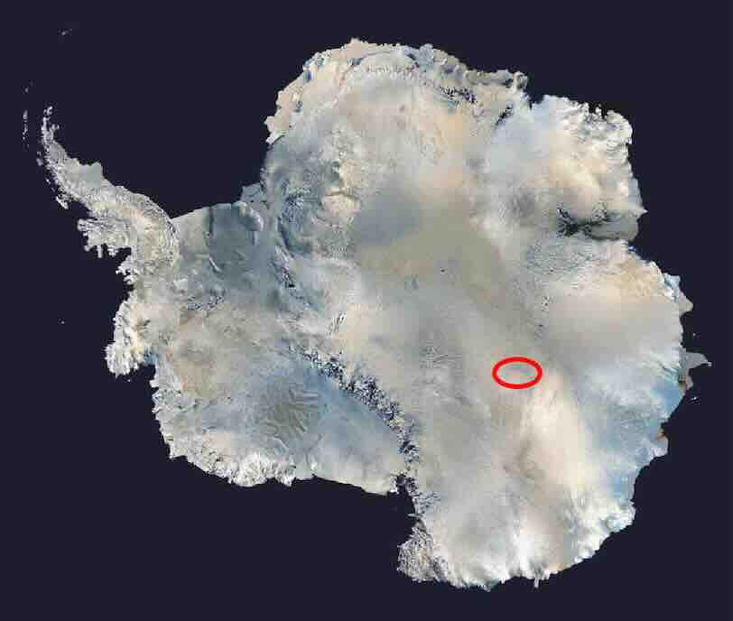
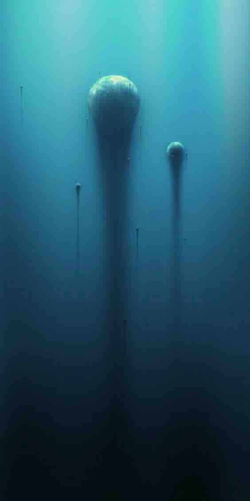

# Gentle Night (2148)

Antarctica, the eternal ice continent, covers an area of approximately 13 million square kilometers, with a massive ice sheet 2000 to 4000 meters thick permanently frozen beneath the ice plains.

Located inland in Antarctica, in Princess Elizabeth Land, 1800 meters west of the  Vostok Research Station ( Станция Восток ).

<figure><figcaption>
Vostok Research Station ( Станция Восток )
</figcaption></figure>

From the point of a helicopter, one can see from afar, under the warm sunlight of summer, a vast and and striking butterfly-shaped silver-gray pattern prominently appearing on the ice plain, about 1-2 km wide and stretching 5-6 km. It is densely covered with a large number of shiny retractable solar units, arrayed in a lots of concentric circles,, resembling the large and small round eyes on the wings of a giant butterfly. The scale is astonishing. These state-of-the-art polar photovoltaic devices, akin to sunflowers, automatically track the sun's rays, greedily absorbing every drop of sunlight's energy before the long polar night arrives.

Beneath the 4000-meter thick ice layer at Vostok Station lies the world's largest freshwater lake - Lake Vostok, covering an area of 15,690 square kilometers, comparable to the size of Lake Ontario. The average water temperature here is −3℃. Under the immense pressure of the thick ice layer, the lake remains in liquid form, with an extremely high concentration of nitrogen and oxygen. (The oxygen concentration is 5000% that of ordinary freshwater lakes)

<figure><figcaption>
 Ten huge spherical submarines
</figcaption></figure>

In this eternal dark ocean world, there is still a glimmer of light. That is the ten huge spherical submarines autonomously hover in the dark Lake Vostok, with the light of their beacons particularly conspicuous in the darkness, with strange creatures constantly passing in front of the lights. Huge flexible floating cables connect the submarines and lead to the ice surface.

Each spherical submarine is a giant beehive, densely carrying 10,000 life capsules, continuously monitoring and maintaining the normal operation of the capsule's life.

&#x20;...... ...... ......&#x20;

In the dimensional membrane space of the superstring universe, the strong psychic wave of Fuji 1 Eucalyptus Ishihara and Fuji 2 Black Dragon has infected Nuwa, as the dragon of light magic. In front of the interests of her people, Nuwa is so fragile at this moment. The time ranch under the glacier of Vostok Station gathers a quantum matrix of 100,000 human psychic bodies, forming a huge dark universe energy field vortex.

The energy field awaits the trigger of Nuwa's psychic wave. Once activated, the vortex will instantly release a huge dark universe energy wave that will sweep the globe, and humans will be completely controlled, becoming the stepping stone for the rise of the divine dragon tribe....

Emotion - the most basic element of humanity and the most precious gift Earth has given to the DragonCapsule symbiotes, where will she go?

One year later, Nuwa finally awakens, and she has made her final choice......
