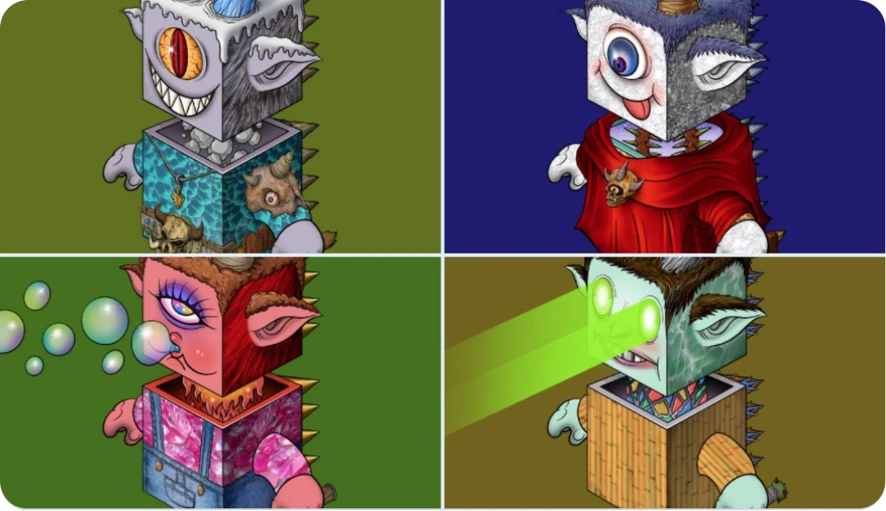

# DragonCapsule Archives

## DragonCapsule NFT SPECS

Each DragonCapsule is unique and programmatically generated from over 381 possible traits, including facial expressions, magic corners, clothing, and more. There are millions of possible DCs, and the release version is only 10,000, including a Prime DC egg dragon capsule. All DCs are unique, but some are rarer than others.

The DragonCapsule is stored as an ERC-721 NFT on the Ethereum blockchain and hosted on IPFS (See Records and Proofs). Purchasing an DC costs 0.01 \~ 1 ETH.

\

## DRAGON CAPSULE FILES

* **Nature Dragon**

<table data-header-hidden><thead><tr><th width="150"></th><th width="150"></th><th></th></tr></thead><tbody><tr><td><strong>Traits</strong></td><td><strong>Quantity</strong></td><td><strong>Description</strong></td></tr><tr><td>BACKFINS</td><td>17</td><td>Backfins are necessary equipment for space travel. Different dragon fins have different abilities. Some dragon fins may be antennas, and some dragon fins can cut through multi-dimensional space and travel through multi-dimensional universes through space cracks.</td></tr><tr><td>BODYS</td><td>40</td><td>After the Dragon capsule fell on the earth, it combined with different natural environments to produce different dragon heads, dragon bodies, and textures. These textures represent various elements of nature and also possess various powers of nature.</td></tr><tr><td>HEADS</td><td>39</td><td>Like the dragon body, The dragon head is a magical creature combined with nature</td></tr><tr><td>NECKS</td><td>20</td><td>Nature dragons absorb power from plants, animals, rocks, climate, and the environment. The dragon neck is the channel for energy conversion.</td></tr><tr><td>FACES</td><td>48</td><td>Natural dragons are the product of highly civilized evolution. They have a variety of personalities, and their faces and expressions represent their personalities.</td></tr><tr><td>HORNS</td><td>27</td><td>
Nature dragons naturally have the consciousness of protecting the environment. This is the source of their power to rule the Shenlong continent. Dragon horns have various natural element attributes, and they are also the source of nature dragons to absorb natural power. The natural element attributes of dragon horns:

"Icebergs, Rocks, Forests, Beasts, Sky fires, Lightning, Aurora, Tornadoes, Huge waves, Meadows, Hills, Deserts, Succulents, Ore, Wildfires..." etc
</td></tr><tr><td>CLOTHES</td><td>10</td><td>
Only a handful of nature dragons possess these ordinary clothes, and they have different magical functions under the ordinary appearance, such as:

"Kung Fu Tang suit, Medusa vest, teleport sweater..." etc.
</td></tr><tr><td>SUITS</td><td>18</td><td>
A few advanced nature dragon suits, including

"Robe of mage, skull artifact, dragon battle suit, flight jacket, devouring T-shirt, magic suit, Viking savage battle suit, fire dragon hoodie..." etc.
</td></tr><tr><td>WEAPONS</td><td>15</td><td>Naturel Dragon’s weapons include: "Thor’s Hammer, Death Sword, Viking Tomahawk, Lightning Spear..." etc.</td></tr></tbody></table>

\

* **Robot Dragon**

<table data-header-hidden><thead><tr><th width="150"></th><th width="150"></th><th></th></tr></thead><tbody><tr><td><strong>Traits</strong></td><td><strong>Quantity</strong></td><td><strong>Description</strong></td></tr><tr><td>HEADS</td><td>10</td><td>After the DragonCapsule fell to earth, it combined with different metals to produce different heads, bodies and textures, which represented various metal elements, with various mechanical powers and were also the main control unit of the robot dragons</td></tr><tr><td>SIDE PANEL</td><td>12</td><td>The side panel of the robot dragon is the energy photosynthetic board, which is a high-efficiency  light quantum energy supply unit</td></tr><tr><td>EARS</td><td>5</td><td>The robot dragon ear has a variety of functions, including "quantum antenna, high-frequency radar, dark matter light sensor..." etc.</td></tr><tr><td>NECKS</td><td>5</td><td>The robot dragon's neck is the bus for energy and data transmission, and it is also the Achilles' Heel of the robotic dragon.</td></tr><tr><td>BODYS</td><td>20</td><td>The robot dragon is combined with different metals to produce different dragon bodies and textures. These textures represent various metal elements, have various mechanical powers, and are also the energy core and engine of the robot dragon.</td></tr><tr><td>HORNS</td><td>8</td><td>Robot dragons naturally have the consciousness of war and plunder. Dragon horns and dragon belly include these war equipment.</td></tr><tr><td>ARMS</td><td>3</td><td>Possesses the ability to manipulate cyberspace and machine civilization, including virtual reality, space compression...</td></tr><tr><td>HANDS</td><td>5</td><td>Possesses the ability to manipulate cyberspace and machine civilization, including virtual reality, space compression...</td></tr><tr><td>SCREWS</td><td>3</td><td>The connected parts of the robot dragon's quantum brain, housed in these tiny screws</td></tr><tr><td>BELLYS</td><td>6</td><td>The belly is the main weapon of the robot dragon</td></tr></tbody></table>

\

* **Skull Dragon**

<table data-header-hidden><thead><tr><th width="150"></th><th width="150"></th><th></th></tr></thead><tbody><tr><td><strong>Traits</strong></td><td><strong>Quantity</strong></td><td><strong>Description</strong></td></tr><tr><td>BACKFINS</td><td>1</td><td>Dragon fins are necessary equipment for space travel. Different dragon fins have different abilities. Skull dragon fins can cut through multi-dimensional space and travel through multi-dimensional parallel universes through space cracks.</td></tr><tr><td>HEADS</td><td>10</td><td>Connecting to the multi-dimensional dark universe, different dragon heads, dragon bodies, and textures represent various elements of the dark universe, and they also have various powers of the dark universe</td></tr><tr><td>HORNS</td><td>1</td><td>Dragon Horn is the dark universe signal generator of the Skull Dragon</td></tr><tr><td>FACES</td><td>3</td><td>Skull dragons have no emotions and no good or evil, their expressions are just the appearance given by the dark universe</td></tr><tr><td>EARS</td><td>3</td><td>Long ears are directly connected to the brain, collecting signals from the dark universe</td></tr><tr><td>HANDS</td><td>1</td><td>The skull dragon hand has the potential ability to manipulate the entropy of the universe. This ability is unique in the entire dragon family.</td></tr><tr><td>BODYS</td><td>7</td><td>Connecting to the multi-dimensional dark universe, different dragon heads, dragon bodies, and textures represent various elements of the dark universe, and they also have various powers of the dark universe</td></tr><tr><td>BELLYS</td><td>1</td><td>Skull dragon belly represents the power of the dark space</td></tr><tr><td>WEAPONS</td><td>1</td><td>The Skull Dragon weapon is the dark god dragon bone of the ancient dragon clan</td></tr></tbody></table>

\

* Create by @YieldDAO Metaverse (YDM), All Rights Reserved.

